<div align="center">

# crt.sh

**Certificate Transparency Subdomain Hunter**

[](https://github.com/az7rb/crt.sh/releases/latest)
[](https://golang.org)
[](LICENSE)
[](https://github.com/az7rb/crt.sh/stargazers)

Fast subdomain discovery across **4 Certificate Transparency log sources** in parallel.  
Single binary · No API keys · No dependencies.

</div>



---

## Install

```bash
GOPROXY=direct go install github.com/az7rb/crt.sh/v3@latest
```

<details>
<summary>Other install methods</summary>

**Download binary** — grab a prebuilt release for your OS from [Releases](https://github.com/az7rb/crt.sh/releases/latest):

| OS | File |
|---|---|
| Linux amd64 | `crt.sh_*_linux_amd64.tar.gz` |
| Linux arm64 | `crt.sh_*_linux_arm64.tar.gz` |
| macOS amd64 | `crt.sh_*_darwin_amd64.tar.gz` |
| macOS arm64 | `crt.sh_*_darwin_arm64.tar.gz` |
| Windows amd64 | `crt.sh_*_windows_amd64.zip` |

**Build from source:**

```bash
git clone https://github.com/az7rb/crt.sh
cd crt.sh
go build -ldflags "-X main.version=3.0.0" -o crt.sh .
```

</details>

---

## Usage

```
crt.sh [options]

  -d  <domain>    Target domain · comma-separated for multiple (-d a.com,b.com)
  -l  <file>      File with one domain per line
  -O  <org>       Organization name search via crt.sh (e.g. -O "Google LLC")
  -f  <format>    Output format: txt (default) | json | burp
  -o  <file>      Output file · auto-named when -f is set
  -a              Append to output file instead of overwrite
  -s  <names>     Skip sources: crt.sh, certspotter, crt.name, shodan-ctl
  -t  <sec>       HTTP timeout per source (default: 30)
  -q              Quiet mode — subdomains only, pipe-safe
  -update         Self-update to the latest version
```

### Examples

```bash
# Scan a domain
crt.sh -d hackerone.com

# Multiple domains, save as JSON
crt.sh -d hackerone.com,bugcrowd.com -f json

# Scan from a list, export Burp scope
crt.sh -l targets.txt -f burp -o scope.json

# Skip a source
crt.sh -d hackerone.com -s shodan-ctl,certspotter

# Pipe to other tools
crt.sh -d hackerone.com -q | httpx -silent
crt.sh -d hackerone.com -q | anew subs.txt

# Search by organization
crt.sh -O "HackerOne Inc"
```

---

## Output

**`-f txt`** (default) — Sources update in place as each finishes. Subdomains stream live under `[+] Results`.

```
[*] Scanning hackerone.com
    ✔  shodan-ctl     → 9 found [263ms]
    ✔  crt.name       → 31 found [471ms]
    ✔  certspotter    → 9 found [688ms]
    ✔  crt.sh         → 15 found [7412ms]

[+] Results
3d.hackerone.com
api.hackerone.com
...

[+] Found 33 unique subdomains for hackerone.com [7.5s]
```

**`-f json`** — Structured output with per-source stats:

```json
{
  "domain": "hackerone.com",
  "timestamp": "2026-09-05T10:00:00Z",
  "total": 33,
  "sources": {
    "crt.sh":      { "count": 15, "duration_ms": 7412 },
    "certspotter": { "count": 9,  "duration_ms": 688 },
    "crt.name":    { "count": 31, "duration_ms": 471 },
    "shodan-ctl":  { "count": 9,  "duration_ms": 263 }
  },
  "subdomains": ["3d.hackerone.com", "api.hackerone.com", "..."]
}
```

**`-f burp`** — Burp Suite advanced scope. Import via **Project → Import**:

```json
{
  "target": {
    "scope": {
      "advanced_mode": true,
      "include": [
        { "enabled": true, "host": "^api\\.hackerone\\.com$", "protocol": "any" }
      ]
    }
  }
}
```

---

## Sources

All four queried simultaneously — total scan time equals the slowest source, not the sum.

| Source | Provider | Method |
|---|---|---|
| [crt.sh](https://crt.sh) | Sectigo | JSON API · `%.domain` wildcard |
| [certspotter](https://sslmate.com/certspotter) | SSLMate | JSON + auto-pagination |
| [crt.name](https://crt.name) | Independent | Reads Google Argon, Sectigo, Cloudflare CT |
| [Shodan CTL](https://ctl.shodan.io) | Shodan | Certificate Transparency log index |

---

## Additional Resources

For more tools and resources, visit **[BugBountyzip](https://github.com/BugBountyzip)** — a curated collection of bug bounty tools.

> Previous Bash versions: [v1.0.0](https://github.com/az7rb/crt.sh/releases/tag/v1.0.0) · [v2.0.0](https://github.com/az7rb/crt.sh/releases/tag/v2.0.0)

---

<div align="center">

Happy hunting! 🎯

</div>
